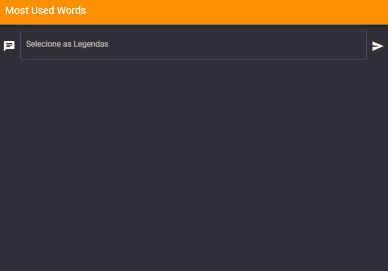

<h1 align="center">
 
Must Used Word
</h1>

Must used words é um aplicativo desktop feito em electron e VueJS que verifica ocorrência das palavras em uma legenda, ordenando da de maior ocorrência para com menos ocorrência.

  

[//]: # 

  

  
   

## Features
[//]: # (Add the features of your project here:)
Este app utiliza o que há de mais recente nas tecnologias JavaScript para criação Desktop

- **VueJS** - Framework JavaScript para criação de interfaces
- **Electron** —  Framework JavaScript para desenvolvimento de aplicações desktop
- **Vuetify** - Biblioteca de componentes Material Desing para VueJS

## Getting started

1. Clone o repositório usando `git clone https://github.com/igortuag/most-used-words`
2. Mova para um diretorio de sua prefêrencia: `cd React-Calculator` 
3. Execute o comando `npm install or yarn` para instalar as depêndencias 
4. Execute o comando `npm electron:serve` ou `npm electron:build` para iniciar o app

## Licença

Este projeto usa Licença MIT - Saiba mais na pagina [Licença MIT](https://opensource.org/licenses/MIT).
